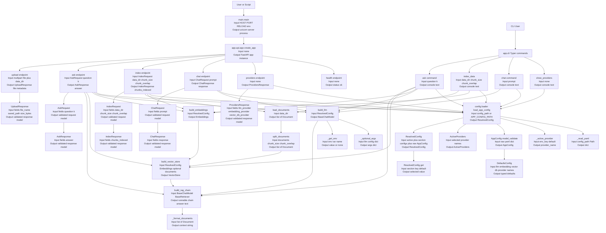

# Python LangChain Module

Complete LangChain starter project with a single shared configuration for:
- LLM providers
- Embedding providers
- Vector databases

Current default stack in config:
- LLM: `ollama` (`llama3.2`)
- Embeddings: `ollama` (`nomic-embed-text`)
- Vector DB: `chroma`

## Setup

```bash
python -m venv .venv
.\.venv\Scripts\Activate.ps1
pip install -r requirements.txt
cp .env.example .env
python src/main.py
```

Common provider config is in `config/providers.yaml`.

Active providers are selected by env vars:
- `ACTIVE_LLM_PROVIDER`
- `ACTIVE_EMBEDDING_PROVIDER`
- `ACTIVE_VECTOR_DB_PROVIDER`

Supported providers:
- LLM: `openai`, `anthropic`, `google`, `ollama`
- Embeddings: `openai`, `huggingface`, `ollama`
- Vector DB: `chroma`, `faiss`, `qdrant`

OpenAI-compatible gateway support:
- You can point both OpenAI chat and embeddings to a custom gateway URL (for example a hackathon endpoint) using `OPENAI_BASE_URL`.
- Example: `OPENAI_BASE_URL=https://tcsopenai.com/v1`
- Precedence: env var `OPENAI_BASE_URL` first, then `base_url` from `config/providers.yaml`.

Anthropic custom endpoint support:
- You can set a custom Anthropic endpoint using `ANTHROPIC_API_URL` (preferred) or `ANTHROPIC_BASE_URL`.
- Example: `ANTHROPIC_API_URL=https://your-anthropic-gateway.example.com`
- Precedence: `ANTHROPIC_API_URL`, then `ANTHROPIC_BASE_URL`, then `base_url` from `config/providers.yaml`.

## Architecture Flowchart (All Functions + Inputs/Outputs)




Health check:

```bash
curl http://127.0.0.1:8000/health
```

PowerShell alternative:

```powershell
Invoke-RestMethod http://127.0.0.1:8000/health
```

Providers:

```bash
curl http://127.0.0.1:8000/providers
```

PowerShell alternative:

```powershell
Invoke-RestMethod http://127.0.0.1:8000/providers
```

Chat:

```bash
curl -X POST http://127.0.0.1:8000/chat -H "Content-Type: application/json" -d "{\"prompt\": \"What is LangChain?\"}"
```

PowerShell alternative:

```powershell
$body = @{ prompt = "What is LangChain?" } | ConvertTo-Json
Invoke-RestMethod http://127.0.0.1:8000/chat -Method Post -ContentType "application/json" -Body $body
```

Index documents:

```bash
curl -X POST http://127.0.0.1:8000/index -H "Content-Type: application/json" -d "{\"data_dir\": \"data\", \"chunk_size\": 1000, \"chunk_overlap\": 150}"
```

PowerShell alternative:

```powershell
$body = @{ data_dir = "data"; chunk_size = 1000; chunk_overlap = 150 } | ConvertTo-Json
Invoke-RestMethod http://127.0.0.1:8000/index -Method Post -ContentType "application/json" -Body $body
```

Ask with RAG:

```bash
curl -X POST http://127.0.0.1:8000/ask -H "Content-Type: application/json" -d "{\"question\": \"Summarize indexed docs\", \"k\": 4}"
```

Ask with MMR ranking:

```bash
curl -X POST http://127.0.0.1:8000/ask -H "Content-Type: application/json" -d "{\"question\": \"Summarize indexed docs\", \"k\": 4, \"ranking_strategy\": \"mmr\", \"fetch_k\": 16, \"lambda_mult\": 0.5}"
```

PowerShell alternative:

```powershell
$body = @{ question = "Summarize indexed docs"; k = 4 } | ConvertTo-Json
Invoke-RestMethod http://127.0.0.1:8000/ask -Method Post -ContentType "application/json" -Body $body
```

PowerShell with MMR ranking:

```powershell
$body = @{ question = "Summarize indexed docs"; k = 4; ranking_strategy = "mmr"; fetch_k = 16; lambda_mult = 0.5 } | ConvertTo-Json
Invoke-RestMethod http://127.0.0.1:8000/ask -Method Post -ContentType "application/json" -Body $body
```

Upload file to data folder:

```bash
curl -X POST http://127.0.0.1:8000/upload -F "file=@data/sample.pdf" -F "data_dir=data"
```

PowerShell alternative:

```powershell
Invoke-RestMethod http://127.0.0.1:8000/upload -Method Post -Form @{ file = Get-Item "data/sample.pdf"; data_dir = "data" }
```

Upload behavior:
- The file is saved to `data_dir` and indexed immediately.
- Response includes `indexed_chunks` for that uploaded file.

Supported file types for upload/index: `.txt`, `.md`, `.csv`, `.pdf`.

Interactive docs:
- Swagger UI: http://127.0.0.1:8000/docs
- ReDoc: http://127.0.0.1:8000/redoc
